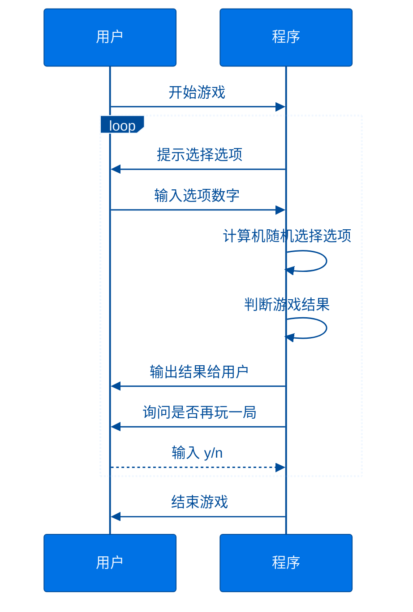
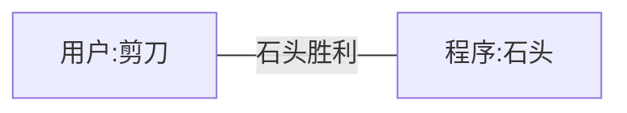
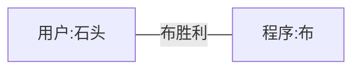
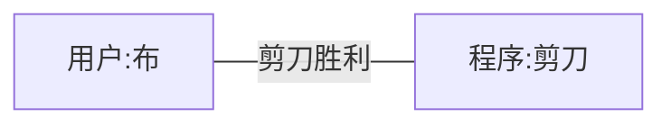
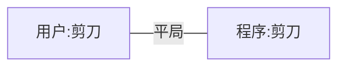
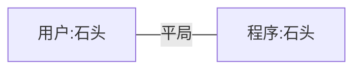
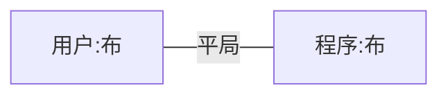

# 猜拳游戏

基于Python语言编写一个猜拳游戏程序

---
theme: ./themes
layout: center
---

# 程序流程

- 开始游戏
- 提示选择选项
- 输入选项数字
- 计算机随机选择选项
- 判断游戏结果
- 输出结果给用户
- 询问是否再玩一局
- 输入 y/n 
- 程序->>用户: 结束游戏

---
theme: ./themes
layout: osins-mermaid
---

# 程序流程图


  
---
theme: ./themes
layout: center
---
  
## 游戏规则













---
theme: ./themes
layout: osins-code
---

## 随机函数 random

在 Python 中，要使用随机数生成函数，您可以使用 random 模块。以下是使用 random 模块的详细步骤：

- 导入 random 模块。在 Python 中，您需要先导入 random 模块才能使用其中提供的随机数生成函数。您可以使用以下代码导入 random 模块：
  
```python
import random
```

这将使您能够在程序中使用 random 模块中提供的所有函数。

- 使用 random 模块中的函数生成随机数。以下是一些 random 模块中常用的随机数生成函数：

random()：生成一个范围在 0 到 1 之间的随机浮点数。

```python
x = random.random()
print(x)
```
randint(a, b)：生成一个范围在 a 和 b 之间的随机整数。

```python
x = random.randint(1, 10)
print(x)

```

choice(sequence)：从给定序列中随机选择一个元素。

```python
my_list = [1, 2, 3, 4, 5]
x = random.choice(my_list)
print(x)
```

shuffle(sequence)：随机打乱给定序列中的元素顺序。

```python
my_list = [1, 2, 3, 4, 5]
random.shuffle(my_list)
print(my_list)
```

这些是 random 模块中最常用的随机数生成函数。在使用这些函数时，您需要根据自己的需要传递相应的参数，例如范围、序列等。

---
theme: ./themes
layout: center
---

## 代码示例

```python
import random

def game():
    options = ["剪刀", "石头", "布"]
    computer_choice = random.choice(options)
    user_choice = input("请输入剪刀、石头或布：")
    if user_choice not in options:
        print("请输入正确的选项！")
        return
    if user_choice == computer_choice:
        print("平局！")
        return
    if (user_choice == "剪刀" and computer_choice == "布") 
        or (user_choice == "石头" and computer_choice == "剪刀") 
        or (user_choice == "布" and computer_choice == "石头"):
        print("你赢了！")
    else:
        print("你输了！")
    game()

game()
```

---
theme: ./themes
layout: center
---

## 游戏运行效果

```bash
$ python3 ./play_game0.py 

Choose rock, paper, or scissors: rock
Computer chose paper
You lose!
Play again? (y/n): y
Choose rock, paper, or scissors: paper
Computer chose paper
Tie!
Play again? (y/n): n
```
